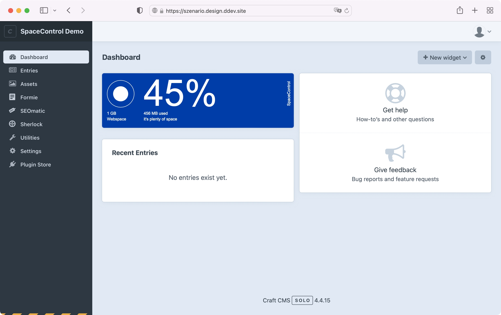
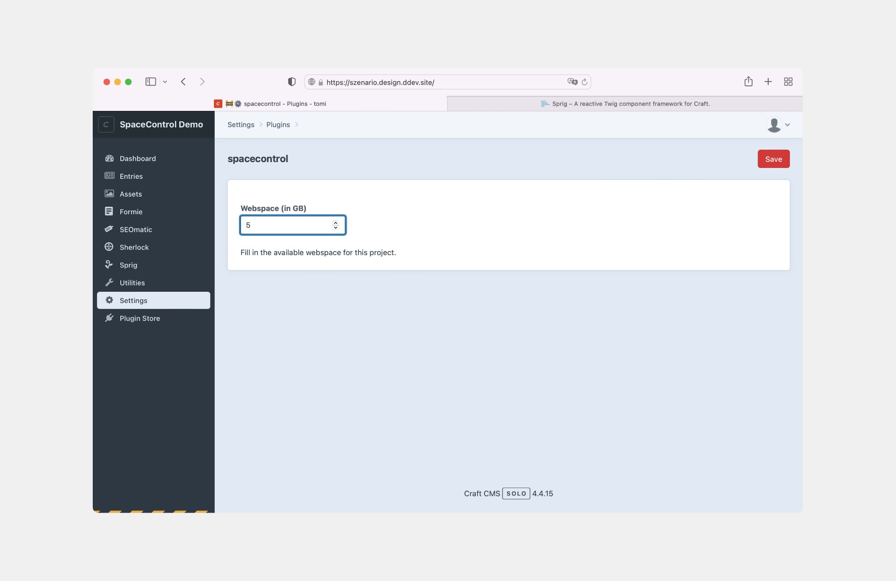

# SpaceControl

### Webspace monitoring on point.

SpaceControl is a powerful plugin crafted to ensure you never run out of webspace. With its visually pleasing interface,
it offers perfect precision and unwavering reliability, allowing you to stay informed about your webspace usage at all
times and receive visual alerts if specific thresholds are approached.

But that's not all – we have exciting plans for even more enhancements in the pipeline!

**Note**: _The license fee for this plugin is $10.00 via the Craft Plugin Store._

## Requirements

This plugin requires Craft CMS 4.3.5 or later, and PHP 8.0.2 or later.

## Installation

To install SpaceControl, follow these steps:

1. Open your terminal and go to your Craft project:

       cd /path/to/project

2. Then tell Composer to load the plugin:

       composer require szenario/craft-spacecontrol.

3. Install the plugin via `./craft install/plugin spacecontrol` via the CLI, or in the Control Panel, go to Settings →
   Plugins and click the “Install” button for SpaceControl.

You can also install SpaceControl via the **Plugin Store** in the Craft Control Panel.

## Settings

An initial setup is obligatory to run the widget.

  Made possible by
   
  
    
  The team behind the magic 
  <a href="https://twitter.com/smonist">Simon Wesp</a>, 
  <a href="https://twitter.com/thomasbendl">Thomas Bendl</a>,
  Erich Bendl  

