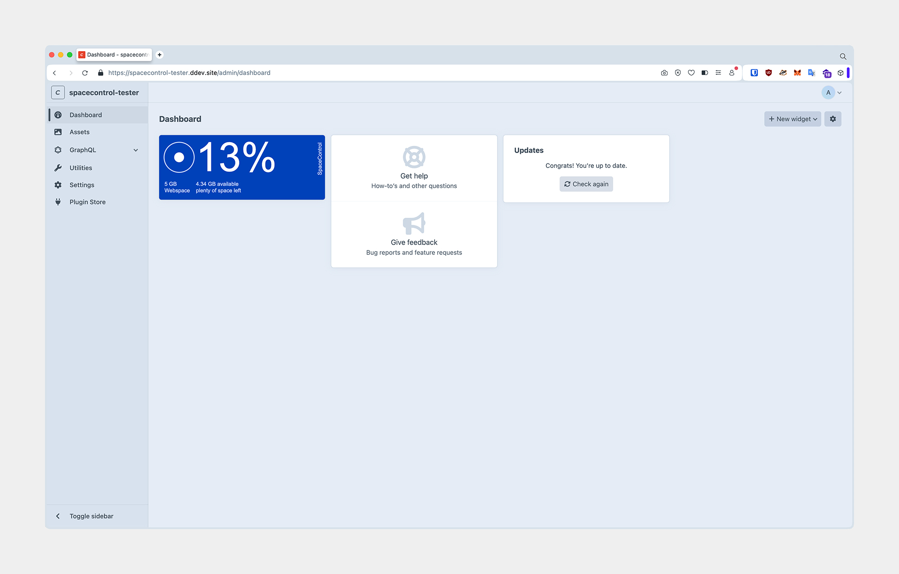
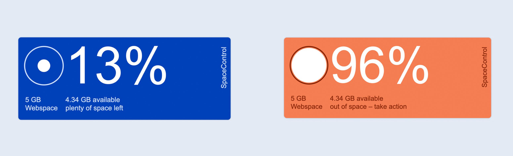
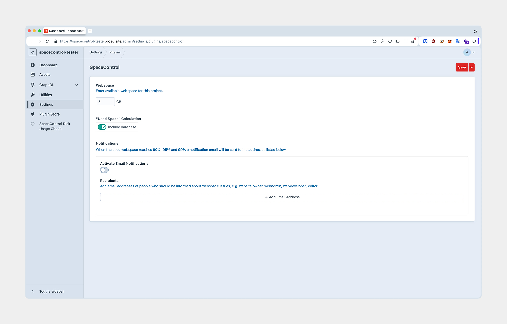

# spacecontrol

### Webspace Monitoring On Point.

spacecontrol was made to ensure you never run out of webspace. With its minimal interface the widget provides an easy
overview of the current webspace usage, displays a warning and sends email notifications when it’s time for taking action.  

A few pixels on your Craft dashboard, a big step for your website.
  

**Note**: _The license fee for this plugin is $10 for the first year plus $5/year after one year via the Craft Plugin Store._
## Requirements

This plugin requires Craft CMS 5.0.0 or later and PHP 8.2 or later.

## Installation

The **easiest way** to install spacecontrol is via the Craft **<a href="https://plugins.craftcms.com/spacecontrol" target="_blank">Plugin Store</a>** in your control panel.  
  
To install spacecontrol using Composer, follow these steps:

1. Open your terminal and go to your Craft project:

       cd /path/to/project

2. Then tell Composer to load the plugin:

       composer require szenario/craft-spacecontrol

3. Install the plugin via `craft install/plugin spacecontrol` via the CLI, or in the Control Panel, go to Settings →
   Plugins and click the “Install” button for spacecontrol.

## Settings

An initial setup is obligatory to run the widget.

  Made possible by
   
  
    
  The team behind the magic 
  <a href="https://twitter.com/smonist">Simon Wesp</a>, 
  <a href="https://twitter.com/thomasbendl">Thomas Bendl</a>,
  Erich Bendl  

